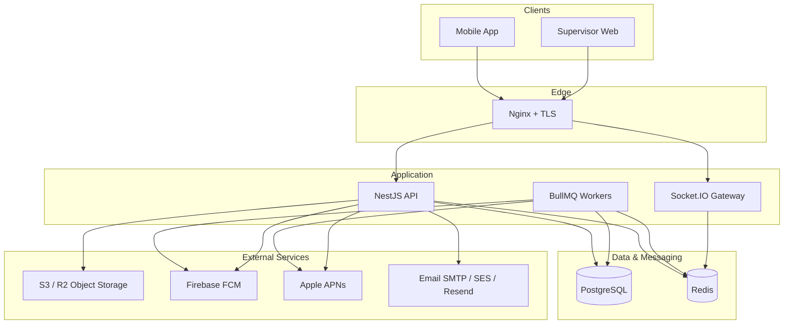

# Production Architecture

High-level view of the GuardTrak API and its infrastructure dependencies.

**Mode A (development):** local PostgreSQL 18, local storage, optional Redis, `npm run start:dev` — no Docker required.  
**Mode B (production):** Nginx → PM2-managed NestJS (primary). Docker Compose is optional. See [deployment.md](./deployment.md).

## Component diagram

## Data flow summary

| Path | Description |
|------|-------------|
| REST | Mobile/web → Nginx → NestJS → Postgres |
| Real-time | Clients ↔ Socket.IO ↔ Redis adapter (multi-instance) |
| Evidence | API presigns uploads → client → S3/R2/MinIO |
| Notifications | API persists notification → queue → FCM/APNs |
| Email | Auth/ops events → queue or direct → SMTP/SES/Resend |
| Idempotency / cache | API ↔ Redis (or in-memory fallback when disabled) |

## Deployment topologies

**Single VPS (Hostinger):** Docker Compose runs API, Postgres, and Redis on one host; Nginx terminates TLS; object storage is external (S3/R2).

**Scaled:** Multiple API containers behind a load balancer; shared Postgres, Redis, and object storage; WebSockets require Redis adapter.

## Related docs

- [docker.md](./docker.md) — local and Compose layouts
- [deployment.md](./deployment.md) — VPS rollout
- [redis.md](./redis.md) / [bullmq-queues.md](./bullmq-queues.md) — messaging
- [cloud-storage.md](./cloud-storage.md) — evidence objects
- [push-notifications.md](./push-notifications.md) / [email.md](./email.md) — outbound channels
- [monitoring.md](./monitoring.md) — health and metrics
